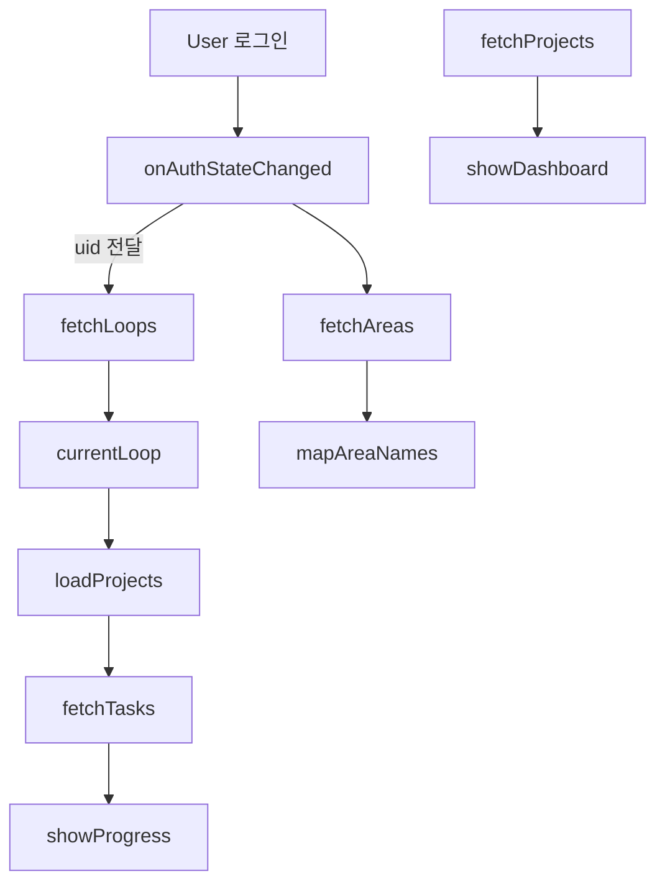

# 🌱 Monthly Grow - Firebase 데이터 구조 및 흐름도

이 문서는 Monthly Grow 앱의 Firebase Firestore 구조와 주요 데이터 흐름을 시각화 및 문서화한 내용입니다.

---

## 🔑 전제 사항

- 사용자는 소셜 로그인(Firebase Auth, 구글)으로 인증됨
- 사용자 UID를 기준으로 모든 컬렉션의 데이터는 격리됨 (`userId`)
- 현재 Firestore를 사용하며 NoSQL 구조에 적합하게 데이터가 분산 저장됨
- 모든 UI는 **모바일 우선**, 추후 반응형 확장 가능

---

## 🧱 주요 컬렉션 정의

### 🔹 users

```ts
{
  id: string; // uid
  displayName: string;
  email: string;
  createdAt: ISODate;
}
```

### 🔹 areas

```ts
{
  id: string;
  userId: string;
  title: string; // 예: "건강", "마음"
  description?: string;
  createdAt: ISODate;
}
```

### 🔹 loops

```ts
{
  id: string; // 예: "loop_2025_04"
  userId: string;
  title: string; // "4월 루프: 건강 관리"
  reward: string; // 예: "새 운동화 구매"
  startDate: YYYY-MM-DD;
  endDate: YYYY-MM-DD;
  status: "active" | "completed" | "failed";
  areaIds: string[]; // 연관 area
  projectIds: string[];
  goal?: number;
  done?: number;
  progress?: { completed: number; total: number; };
  improvement?: { value: number; direction: "up" | "down"; };
}
```

### 🔹 projects

```ts
{
  id: string;
  userId: string;
  title: string;
  description?: string;
  targetCount: number;
  doneCount: number;
  areaId: string;
  loopIds: string[];
  addedDuringLoop?: boolean;
  status: "active" | "archived";
  dueDate?: YYYY-MM-DD;
  createdAt: ISODate;
}
```

### 🔹 tasks

```ts
{
  id: string;
  userId: string;
  projectId: string;
  title: string;
  date: YYYY - MM - DD;
  duration: number; // 분 단위
  done: boolean;
}
```

---

## 🔄 데이터 흐름도 요약 (텍스트 기반)



---

## 📌 화면별 데이터 요구

### 🏠 홈

- 현재 루프 요약 (루프 ID, 진행률, 보상 등)
- 루프에 연결된 프로젝트 요약
- 대시보드 (이달의 활동 요약: 완료 프로젝트 수, 집중 시간 등)

### 🌀 루프 페이지

- 현재/다음/지난 루프 목록
- 루프 생성 & 편집 UI → area + 프로젝트 연결

### 📁 프로젝트 페이지

- 전체 프로젝트 목록
- 필터링 (area, 루프 연결 여부)
- 프로젝트 상세 → 해당 태스크 목록, 달력 뷰

### 🧘‍♀️ 활동 뷰어 (대시보드)

- 루프 달성률, 프로젝트 수행률
- 집중 시간, 일일 태스크 수 등 통계 차트
- 전월 대비 증감률 계산 (루프/프로젝트 단위)

---

## 🔐 보안 규칙 요약

```ts
match /{collection}/{docId} {
  allow read, write: if request.auth != null && request.auth.uid == resource.data.userId;
}
```

---

## 🔁 캐싱/동기화

- 사용자 로그인 시 → areas / loops / projects / tasks 불러오기
- 상태 관리: jotai로 캐싱
- 새로고침 시 → Firebase Auth 재인증 + Firestore fetch로 복구

---

## 🔧 향후 확장 고려

- `notes`, `reflections`, `inventory` 등 컬렉션 확장
- AI 추천 목표, 자동 태스크 분해 기능
- Model Context Protocol 적용 구조 고려 중
